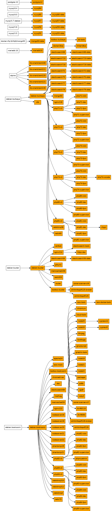

## What is this?

This repo contains all the build files for a highly integrated images for
web development used and developed at NFQ Technologies.

## WARNING

These images are meant for development and CI environment only. Not a single
image was considered for production use while making build and configuration
choices. Production use was neither intended nor suggested.

## How to use?

### Get virtual machine

These images are tested and used in [nfqlt vagrant box](https://app.vagrantup.com/nfqlt/boxes/docker).
Then using provided virtual machine all examlpes should work out of the box.
Otherwise some configuration and examples tweaking would be necessary.

### Explore images

Ready to use nfqlt images are pushed to [docker hub](https://hub.docker.com/u/nfqlt/).

See [example docker-compose.yml](_docs/media/docker-compose-example.yml).

## How to develop?

### base-image

Base images from this namespace should be used instead of images in library
if possible. For example, image `nfqlt/debian-stretch` should be used as a
base for other images instead of `debian:stretch`.

### data-image

Every data image must contain no actual data but be sufficient to run service
with. For example _mysql57-data:latest_ data image may contain database and a
user but must not contain database schema or actual data.

### building images

All makefiles must have these targets:

* __help__ - this target must be default target and shoud print image name and
  all available targets. 
* __build__ - this target must produce image with all required tags.
* __test__ - this target should execute all tests and must return exit code 0
  on success or non-zero exit code on failure. In case no tests was
  implemented this targed must always return with exit code 0.
* __push__ - this target must push image with all tags to registry. Image
  should not be altered in any way by this target.
* __all__ - this target should build, test and push image. In case of one step
  fail, other steps should not be executed and exit code of non-zero value
  must be returned.
* __status__ - this target should print info about created images. Basic info
  should contain full image name, all built tags and their sizes.

Every particular image must be symlinked to exactly one Makefile which in turn
states image type. Every single image must be buildable with command
`make build && make test && make push` executed in particular images directory.

